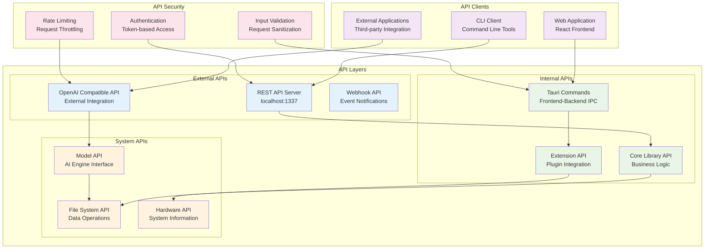
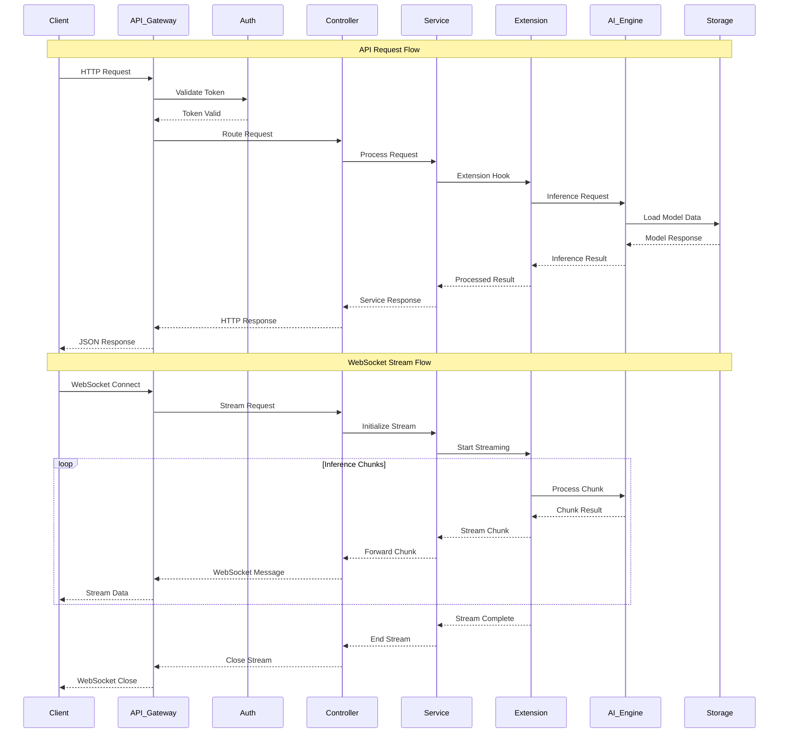
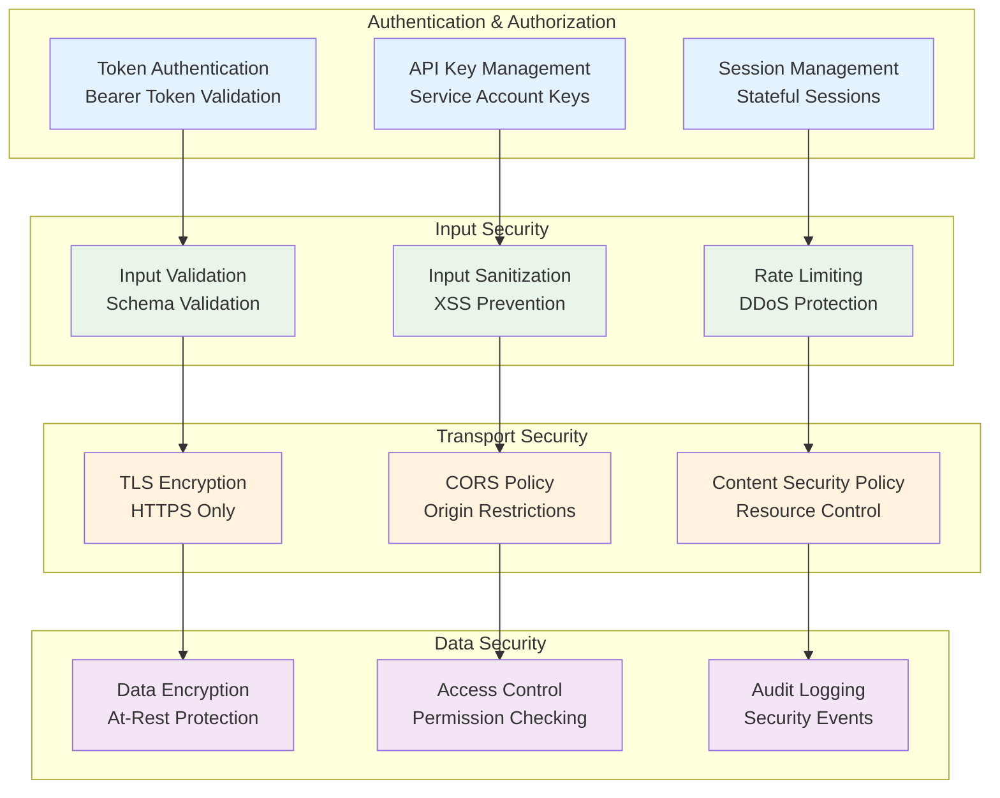

# API Architecture Reference

This document provides detailed information about Jan's API architecture, including internal APIs, extension APIs, and integration patterns.

## API Layer Overview

Jan implements a multi-layered API architecture to provide flexible integration points while maintaining security and performance.



## Tauri Command Architecture

The Tauri command system provides the primary interface between the frontend and backend components.

```mermaid
graph LR
    subgraph "Command Categories"
        FS_CMD[File System Commands<br/>• join_path<br/>• mkdir<br/>• read_file_sync<br/>• write_file_sync]
        
        APP_CMD[Application Commands<br/>• get_app_configurations<br/>• update_app_configuration<br/>• get_jan_data_folder_path]
        
        EXT_CMD[Extension Commands<br/>• install_extensions<br/>• get_active_extensions<br/>• get_jan_extensions_path]
        
        SYS_CMD[System Commands<br/>• relaunch<br/>• factory_reset<br/>• read_logs<br/>• is_library_available]
        
        SERVER_CMD[Server Commands<br/>• start_server<br/>• stop_server<br/>• get_server_status]
        
        MCP_CMD[MCP Commands<br/>• get_tools<br/>• call_tool<br/>• restart_mcp_servers]
        
        THREAD_CMD[Thread Commands<br/>• list_threads<br/>• create_thread<br/>• list_messages<br/>• create_message]
        
        DOWNLOAD_CMD[Download Commands<br/>• download_files<br/>• cancel_download_task]
    end

    subgraph "Command Flow"
        FRONTEND[React Frontend<br/>invoke() calls]
        ROUTER[Command Router<br/>Tauri Handler]
        BACKEND[Rust Backend<br/>Command Implementation]
        RESPONSE[Response Handler<br/>Result Processing]
    end

    FRONTEND --> ROUTER
    ROUTER --> FS_CMD
    ROUTER --> APP_CMD
    ROUTER --> EXT_CMD
    ROUTER --> SYS_CMD
    ROUTER --> SERVER_CMD
    ROUTER --> MCP_CMD
    ROUTER --> THREAD_CMD
    ROUTER --> DOWNLOAD_CMD

    FS_CMD --> BACKEND
    APP_CMD --> BACKEND
    EXT_CMD --> BACKEND
    SYS_CMD --> BACKEND
    SERVER_CMD --> BACKEND
    MCP_CMD --> BACKEND
    THREAD_CMD --> BACKEND
    DOWNLOAD_CMD --> BACKEND

    BACKEND --> RESPONSE
    RESPONSE --> FRONTEND

    classDef command fill:#e8eaf6
    classDef flow fill:#e0f2f1

    class FS_CMD,APP_CMD,EXT_CMD,SYS_CMD,SERVER_CMD,MCP_CMD,THREAD_CMD,DOWNLOAD_CMD command
    class FRONTEND,ROUTER,BACKEND,RESPONSE flow
```

## Extension API Architecture

Extensions interact with the core system through well-defined APIs that provide access to essential services.

```mermaid
graph TB
    subgraph "Extension API Surface"
        BASE_EXT[BaseExtension<br/>Abstract Base Class]
        
        subgraph "Core Services"
            EVENT_SVC[Event Service<br/>• emit()<br/>• on()<br/>• off()]
            FS_SVC[File Service<br/>• readFile()<br/>• writeFile()<br/>• exists()]
            CONFIG_SVC[Config Service<br/>• get()<br/>• set()<br/>• update()]
        end
        
        subgraph "AI Services"
            MODEL_SVC[Model Service<br/>• loadModel()<br/>• inference()<br/>• getModels()]
            CHAT_SVC[Chat Service<br/>• sendMessage()<br/>• createThread()<br/>• getHistory()]
            TOOL_SVC[Tool Service<br/>• registerTool()<br/>• callTool()<br/>• getTools()]
        end
        
        subgraph "UI Services"
            UI_SVC[UI Service<br/>• showNotification()<br/>• openDialog()<br/>• updateStatus()]
            ROUTE_SVC[Route Service<br/>• navigate()<br/>• getRoute()<br/>• registerRoute()]
        end
    end

    subgraph "Extension Lifecycle"
        INIT[onInitialize()<br/>Extension Setup]
        LOAD[onLoad()<br/>Resource Loading]
        ACTIVATE[onActivate()<br/>Service Start]
        DEACTIVATE[onDeactivate()<br/>Service Stop]
        UNLOAD[onUnload()<br/>Cleanup]
    end

    BASE_EXT --> INIT
    INIT --> LOAD
    LOAD --> ACTIVATE
    ACTIVATE --> DEACTIVATE
    DEACTIVATE --> UNLOAD

    BASE_EXT --> EVENT_SVC
    BASE_EXT --> FS_SVC
    BASE_EXT --> CONFIG_SVC
    BASE_EXT --> MODEL_SVC
    BASE_EXT --> CHAT_SVC
    BASE_EXT --> TOOL_SVC
    BASE_EXT --> UI_SVC
    BASE_EXT --> ROUTE_SVC

    classDef baseExt fill:#e8eaf6
    classDef coreService fill:#e0f2f1
    classDef aiService fill:#fff8e1
    classDef uiService fill:#fce4ec
    classDef lifecycle fill:#f3e5f5

    class BASE_EXT baseExt
    class EVENT_SVC,FS_SVC,CONFIG_SVC coreService
    class MODEL_SVC,CHAT_SVC,TOOL_SVC aiService
    class UI_SVC,ROUTE_SVC uiService
    class INIT,LOAD,ACTIVATE,DEACTIVATE,UNLOAD lifecycle
```

## REST API Server Architecture

Jan provides a REST API server for external integration and automation.

```mermaid
graph TB
    subgraph "REST API Endpoints"
        subgraph "Model Management"
            LIST_MODELS[GET /models<br/>List Available Models]
            GET_MODEL[GET /models/{id}<br/>Get Model Details]
            LOAD_MODEL[POST /models/{id}/load<br/>Load Model]
            UNLOAD_MODEL[POST /models/{id}/unload<br/>Unload Model]
        end
        
        subgraph "Chat Completion"
            CHAT_COMPLETE[POST /chat/completions<br/>OpenAI Compatible]
            STREAM_CHAT[POST /chat/completions<br/>Server-Sent Events]
        end
        
        subgraph "Thread Management"
            LIST_THREADS[GET /threads<br/>List Conversations]
            CREATE_THREAD[POST /threads<br/>New Conversation]
            GET_THREAD[GET /threads/{id}<br/>Get Conversation]
            DELETE_THREAD[DELETE /threads/{id}<br/>Delete Conversation]
        end
        
        subgraph "System Information"
            HEALTH_CHECK[GET /health<br/>System Status]
            SYS_INFO[GET /system<br/>Hardware Information]
            CONFIG_INFO[GET /config<br/>Configuration]
        end
    end

    subgraph "Request Processing"
        MIDDLEWARE[Middleware Stack<br/>• CORS<br/>• Authentication<br/>• Rate Limiting<br/>• Validation]
        ROUTER[API Router<br/>Route Matching]
        CONTROLLER[Controllers<br/>Business Logic]
        SERVICE[Services<br/>Data Operations]
    end

    subgraph "Response Handling"
        SERIALIZER[Response Serializer<br/>JSON Format]
        ERROR_HANDLER[Error Handler<br/>Standard Errors]
        LOGGER[Request Logger<br/>Audit Trail]
    end

    LIST_MODELS --> MIDDLEWARE
    GET_MODEL --> MIDDLEWARE
    LOAD_MODEL --> MIDDLEWARE
    UNLOAD_MODEL --> MIDDLEWARE
    CHAT_COMPLETE --> MIDDLEWARE
    STREAM_CHAT --> MIDDLEWARE
    LIST_THREADS --> MIDDLEWARE
    CREATE_THREAD --> MIDDLEWARE
    GET_THREAD --> MIDDLEWARE
    DELETE_THREAD --> MIDDLEWARE
    HEALTH_CHECK --> MIDDLEWARE
    SYS_INFO --> MIDDLEWARE
    CONFIG_INFO --> MIDDLEWARE

    MIDDLEWARE --> ROUTER
    ROUTER --> CONTROLLER
    CONTROLLER --> SERVICE
    SERVICE --> SERIALIZER
    SERIALIZER --> ERROR_HANDLER
    ERROR_HANDLER --> LOGGER

    classDef modelApi fill:#e3f2fd
    classDef chatApi fill:#e8f5e8
    classDef threadApi fill:#fff3e0
    classDef systemApi fill:#f3e5f5
    classDef processing fill:#e8eaf6
    classDef response fill:#fce4ec

    class LIST_MODELS,GET_MODEL,LOAD_MODEL,UNLOAD_MODEL modelApi
    class CHAT_COMPLETE,STREAM_CHAT chatApi
    class LIST_THREADS,CREATE_THREAD,GET_THREAD,DELETE_THREAD threadApi
    class HEALTH_CHECK,SYS_INFO,CONFIG_INFO systemApi
    class MIDDLEWARE,ROUTER,CONTROLLER,SERVICE processing
    class SERIALIZER,ERROR_HANDLER,LOGGER response
```

## Data Flow Through APIs

Understanding how data flows through Jan's API layers is crucial for effective development and debugging.



## API Security Model

Jan implements comprehensive security measures across all API layers.



## API Error Handling

Jan implements standardized error handling across all API layers for consistent error responses.

```mermaid
graph LR
    subgraph "Error Types"
        VALIDATION_ERR[Validation Errors<br/>400 Bad Request]
        AUTH_ERR[Authentication Errors<br/>401 Unauthorized]
        PERMISSION_ERR[Permission Errors<br/>403 Forbidden]
        NOT_FOUND_ERR[Not Found Errors<br/>404 Not Found]
        RATE_LIMIT_ERR[Rate Limit Errors<br/>429 Too Many Requests]
        SERVER_ERR[Server Errors<br/>500 Internal Server Error]
    end

    subgraph "Error Processing"
        CATCH[Error Catching<br/>Try-Catch Blocks]
        CLASSIFY[Error Classification<br/>Error Type Detection]
        FORMAT[Error Formatting<br/>Standard Response Format]
        LOG[Error Logging<br/>Debug Information]
    end

    subgraph "Error Response"
        RESPONSE[Standardized Response<br/>{error: {code, message, details}}]
        CLIENT_ERR[Client Error Handling<br/>User-Friendly Messages]
        RECOVERY[Error Recovery<br/>Fallback Mechanisms]
    end

    VALIDATION_ERR --> CATCH
    AUTH_ERR --> CATCH
    PERMISSION_ERR --> CATCH
    NOT_FOUND_ERR --> CATCH
    RATE_LIMIT_ERR --> CATCH
    SERVER_ERR --> CATCH

    CATCH --> CLASSIFY
    CLASSIFY --> FORMAT
    FORMAT --> LOG
    LOG --> RESPONSE
    RESPONSE --> CLIENT_ERR
    CLIENT_ERR --> RECOVERY

    classDef errorType fill:#ffebee
    classDef processing fill:#e0f2f1
    classDef response fill:#e8f5e8

    class VALIDATION_ERR,AUTH_ERR,PERMISSION_ERR,NOT_FOUND_ERR,RATE_LIMIT_ERR,SERVER_ERR errorType
    class CATCH,CLASSIFY,FORMAT,LOG processing
    class RESPONSE,CLIENT_ERR,RECOVERY response
```

## API Performance Optimization

Jan implements several performance optimization strategies across its API layers.

```mermaid
graph TB
    subgraph "Caching Strategies"
        MEMORY_CACHE[Memory Cache<br/>Frequently Accessed Data]
        MODEL_CACHE[Model Cache<br/>Loaded Models]
        RESPONSE_CACHE[Response Cache<br/>Computed Results]
    end

    subgraph "Request Optimization"
        BATCHING[Request Batching<br/>Multiple Operations]
        COMPRESSION[Response Compression<br/>Gzip/Deflate]
        PAGINATION[Response Pagination<br/>Large Dataset Handling]
    end

    subgraph "Resource Management"
        CONN_POOLING[Connection Pooling<br/>Database Connections]
        RESOURCE_LIMIT[Resource Limiting<br/>Memory/CPU Bounds]
        LAZY_LOADING[Lazy Loading<br/>On-Demand Resources]
    end

    subgraph "Performance Monitoring"
        METRICS[Performance Metrics<br/>Response Time, Throughput]
        PROFILING[Request Profiling<br/>Bottleneck Detection]
        ALERTS[Performance Alerts<br/>Threshold Monitoring]
    end

    MEMORY_CACHE --> METRICS
    MODEL_CACHE --> PROFILING
    RESPONSE_CACHE --> ALERTS

    BATCHING --> METRICS
    COMPRESSION --> PROFILING
    PAGINATION --> ALERTS

    CONN_POOLING --> METRICS
    RESOURCE_LIMIT --> PROFILING
    LAZY_LOADING --> ALERTS

    classDef caching fill:#e3f2fd
    classDef optimization fill:#e8f5e8
    classDef resources fill:#fff3e0
    classDef monitoring fill:#f3e5f5

    class MEMORY_CACHE,MODEL_CACHE,RESPONSE_CACHE caching
    class BATCHING,COMPRESSION,PAGINATION optimization
    class CONN_POOLING,RESOURCE_LIMIT,LAZY_LOADING resources
    class METRICS,PROFILING,ALERTS monitoring
```



## API Integration Patterns

Common patterns for integrating with Jan's API architecture.

### 1. **Direct REST Integration**
```typescript
// REST API client example
const janClient = new JanApiClient('http://localhost:1337');

// Load a model
await janClient.models.load('llama-3-8b');

// Send chat completion
const response = await janClient.chat.completions.create({
  messages: [{ role: 'user', content: 'Hello!' }],
  model: 'llama-3-8b'
});
```

### 2. **WebSocket Streaming**
```typescript
// WebSocket streaming example
const ws = new WebSocket('ws://localhost:1337/chat/stream');

ws.onmessage = (event) => {
  const chunk = JSON.parse(event.data);
  // Handle streaming response chunks
};
```

### 3. **Extension Development**
```typescript
// Extension API example
export class CustomExtension extends BaseExtension {
  async onLoad() {
    // Register API endpoints
    this.registerCommand('custom_operation', this.handleCustomOperation);
    
    // Listen to system events
    this.events.on('model_loaded', this.onModelLoaded);
  }
  
  private async handleCustomOperation(params: any) {
    // Custom business logic
    return { success: true, data: params };
  }
}
```

This comprehensive API architecture enables flexible integration while maintaining security, performance, and maintainability across all system components.