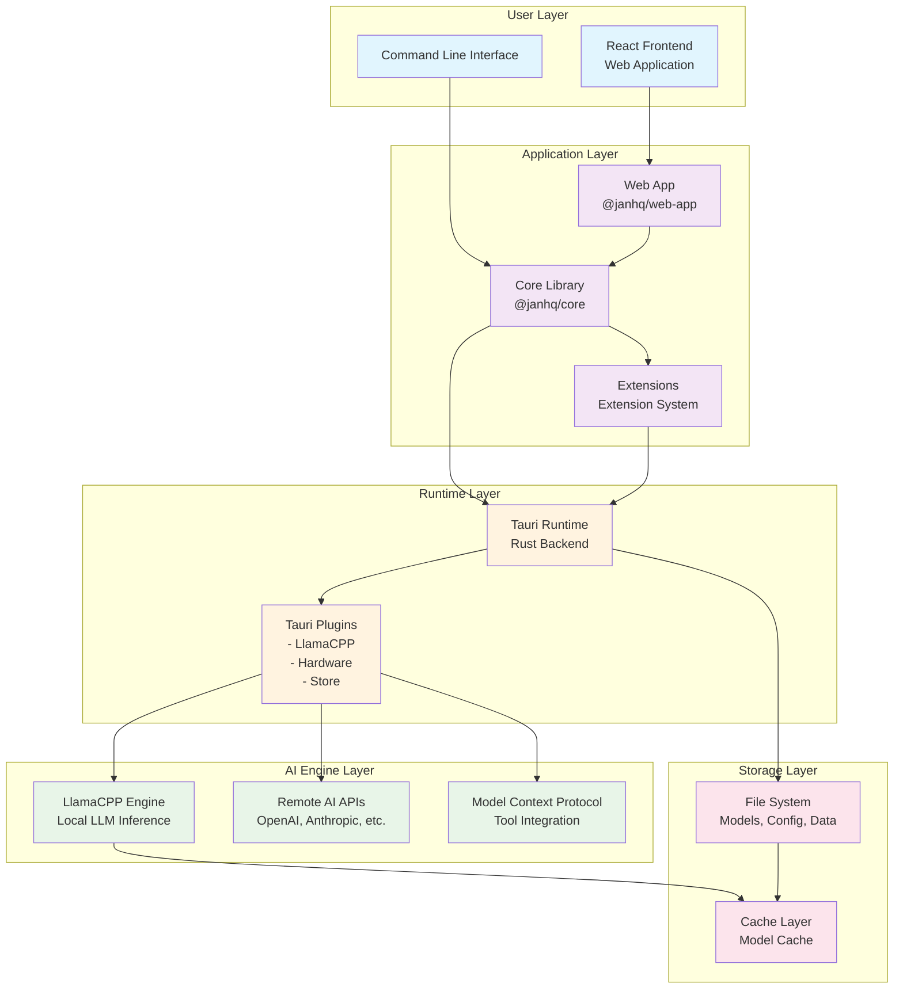
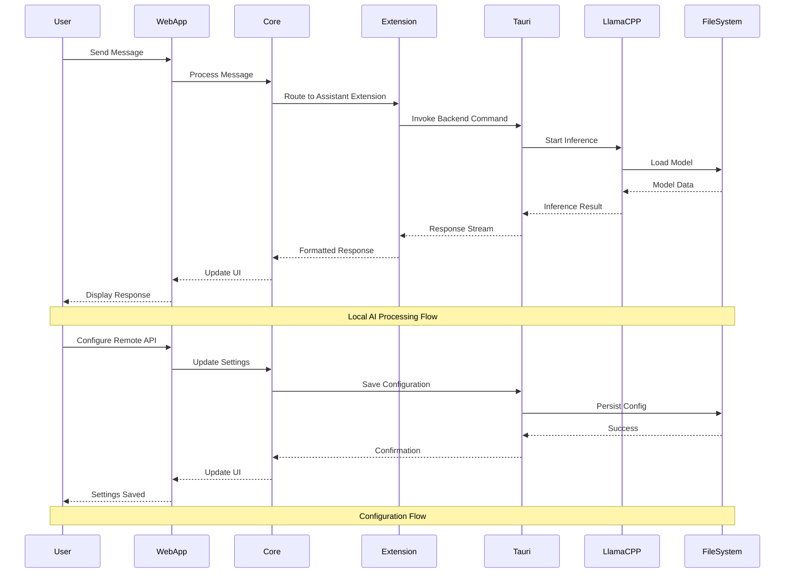

# Jan Technical Architecture

This document provides a comprehensive overview of Jan's technical architecture, including system design, component interactions, and data flow patterns.

## Table of Contents

1. [System Overview](#system-overview)
2. [High-Level Architecture](#high-level-architecture)
3. [Core Module Structure](#core-module-structure)
4. [Extension System](#extension-system)
5. [Data Flow Architecture](#data-flow-architecture)
6. [Deployment Architecture](#deployment-architecture)

## System Overview

Jan is a privacy-first, local AI assistant built with a modern, modular architecture. The application is designed to run AI models locally while providing the flexibility to connect to remote AI services.

### Key Architectural Principles

- **Privacy First**: All AI processing can happen locally without sending data to external services
- **Modular Design**: Extension-based architecture for easy customization and feature expansion
- **Cross-Platform**: Built with Tauri for native desktop performance across Windows, macOS, and Linux
- **Modern Web Technologies**: React-based frontend with TypeScript for type safety

## High-Level Architecture



## Core Module Structure

The core library (`@janhq/core`) provides the foundational types, APIs, and business logic for Jan.

```mermaid
graph TD
    subgraph "Core Library (@janhq/core)"
        INDEX[index.ts<br/>Main Export]
        BROWSER[browser/<br/>Browser Runtime]
        TYPES[types/<br/>Type Definitions]
    end

    subgraph "Type Categories"
        API[api/<br/>API Types]
        ASSISTANT[assistant/<br/>Assistant Types]
        CONFIG[config/<br/>Configuration]
        ENGINE[engine/<br/>Engine Types]
        FILE[file/<br/>File Operations]
        HARDWARE[hardware/<br/>Hardware Detection]
        INFERENCE[inference/<br/>Inference Types]
        MESSAGE[message/<br/>Message Types]
        MODEL[model/<br/>Model Types]
        SETTING[setting/<br/>Settings Types]
        THREAD[thread/<br/>Thread Types]
        MISC[miscellaneous/<br/>Utility Types]
    end

    subgraph "Browser Runtime"
        CORE_SVC[core.ts<br/>Core Service]
        EVENTS[events.ts<br/>Event System]
        EXTENSIONS[extensions/<br/>Extension Manager]
        FS_SVC[fs.ts<br/>File System Service]
        MODELS_SVC[models/<br/>Model Management]
    end

    INDEX --> BROWSER
    INDEX --> TYPES
    TYPES --> API
    TYPES --> ASSISTANT
    TYPES --> CONFIG
    TYPES --> ENGINE
    TYPES --> FILE
    TYPES --> HARDWARE
    TYPES --> INFERENCE
    TYPES --> MESSAGE
    TYPES --> MODEL
    TYPES --> SETTING
    TYPES --> THREAD
    TYPES --> MISC

    BROWSER --> CORE_SVC
    BROWSER --> EVENTS
    BROWSER --> EXTENSIONS
    BROWSER --> FS_SVC
    BROWSER --> MODELS_SVC

    classDef coreModule fill:#e3f2fd
    classDef typeModule fill:#f1f8e9
    classDef browserModule fill:#fff8e1

    class INDEX,BROWSER,TYPES coreModule
    class API,ASSISTANT,CONFIG,ENGINE,FILE,HARDWARE,INFERENCE,MESSAGE,MODEL,SETTING,THREAD,MISC typeModule
    class CORE_SVC,EVENTS,EXTENSIONS,FS_SVC,MODELS_SVC browserModule
```



## Extension System

Jan's extension system enables modular functionality and easy customization.

```mermaid
graph TB
    subgraph "Extension Architecture"
        EXT_MGR[Extension Manager<br/>Core Service]
        
        subgraph "Built-in Extensions"
            ASSISTANT_EXT[Assistant Extension<br/>Core AI Assistant]
            CONV_EXT[Conversational Extension<br/>Chat Interface]
            DL_EXT[Download Extension<br/>Model Downloads]
            LLAMA_EXT[LlamaCPP Extension<br/>Local LLM Runtime]
        end
        
        subgraph "Extension Base"
            BASE_EXT[BaseExtension<br/>Abstract Base Class]
            EXT_API[Extension API<br/>Core Integration]
        end
        
        subgraph "Extension Lifecycle"
            LOAD[onLoad()<br/>Initialize Extension]
            ACTIVATE[onActivate()<br/>Enable Extension]
            DEACTIVATE[onDeactivate()<br/>Disable Extension]
            UNLOAD[onUnload()<br/>Cleanup Extension]
        end
    end

    subgraph "Runtime Integration"
        TAURI_CMD[Tauri Commands<br/>Extension Operations]
        EXT_STORE[Extension Storage<br/>Configuration & State]
        EVENT_BUS[Event Bus<br/>Inter-Extension Communication]
    end

    EXT_MGR --> ASSISTANT_EXT
    EXT_MGR --> CONV_EXT
    EXT_MGR --> DL_EXT
    EXT_MGR --> LLAMA_EXT

    ASSISTANT_EXT --> BASE_EXT
    CONV_EXT --> BASE_EXT
    DL_EXT --> BASE_EXT
    LLAMA_EXT --> BASE_EXT

    BASE_EXT --> EXT_API
    BASE_EXT --> LOAD
    BASE_EXT --> ACTIVATE
    BASE_EXT --> DEACTIVATE
    BASE_EXT --> UNLOAD

    EXT_MGR --> TAURI_CMD
    EXT_MGR --> EXT_STORE
    EXT_MGR --> EVENT_BUS

    classDef extensionCore fill:#e8eaf6
    classDef builtinExt fill:#f3e5f5
    classDef extBase fill:#e0f2f1
    classDef lifecycle fill:#fff3e0
    classDef runtime fill:#fce4ec

    class EXT_MGR extensionCore
    class ASSISTANT_EXT,CONV_EXT,DL_EXT,LLAMA_EXT builtinExt
    class BASE_EXT,EXT_API extBase
    class LOAD,ACTIVATE,DEACTIVATE,UNLOAD lifecycle
    class TAURI_CMD,EXT_STORE,EVENT_BUS runtime
```

## Data Flow Architecture

Understanding how data flows through Jan's architecture is crucial for development and debugging.



## Deployment Architecture

Jan supports multiple deployment scenarios and packaging formats.

```mermaid
graph TB
    subgraph "Source Code"
        SRC[Source Repository<br/>GitHub: jan-ai/jan]
        BUILD[Build System<br/>Makefile + Yarn]
    end

    subgraph "Build Outputs"
        CORE_PKG[Core Package<br/>@janhq/core.tgz]
        WEB_BUNDLE[Web Bundle<br/>Optimized React App]
        TAURI_BINARY[Tauri Binary<br/>Native Executable]
        EXTENSIONS[Extension Packages<br/>*.tgz files]
    end

    subgraph "Platform Packages"
        WIN[Windows<br/>jan.exe + Installer]
        MAC[macOS<br/>jan.dmg + App Bundle]
        LINUX_DEB[Linux (deb)<br/>jan.deb Package]
        LINUX_APP[Linux (AppImage)<br/>jan.AppImage]
    end

    subgraph "Distribution"
        GITHUB[GitHub Releases<br/>Official Downloads]
        WEBSITE[jan.ai<br/>Download Portal]
        FLATPAK[Flatpak<br/>Linux Store]
    end

    subgraph "Runtime Environment"
        OS[Operating System<br/>Windows/macOS/Linux]
        DATA[Data Directory<br/>~/jan/]
        MODELS[Models Storage<br/>Local LLM Files]
        CONFIG[Configuration<br/>Settings & Preferences]
    end

    SRC --> BUILD
    BUILD --> CORE_PKG
    BUILD --> WEB_BUNDLE
    BUILD --> TAURI_BINARY
    BUILD --> EXTENSIONS

    CORE_PKG --> WIN
    CORE_PKG --> MAC
    CORE_PKG --> LINUX_DEB
    CORE_PKG --> LINUX_APP

    WEB_BUNDLE --> WIN
    WEB_BUNDLE --> MAC
    WEB_BUNDLE --> LINUX_DEB
    WEB_BUNDLE --> LINUX_APP

    TAURI_BINARY --> WIN
    TAURI_BINARY --> MAC
    TAURI_BINARY --> LINUX_DEB
    TAURI_BINARY --> LINUX_APP

    EXTENSIONS --> WIN
    EXTENSIONS --> MAC
    EXTENSIONS --> LINUX_DEB
    EXTENSIONS --> LINUX_APP

    WIN --> GITHUB
    MAC --> GITHUB
    LINUX_DEB --> GITHUB
    LINUX_APP --> GITHUB

    GITHUB --> WEBSITE
    LINUX_DEB --> FLATPAK
    LINUX_APP --> FLATPAK

    WIN --> OS
    MAC --> OS
    LINUX_DEB --> OS
    LINUX_APP --> OS

    OS --> DATA
    DATA --> MODELS
    DATA --> CONFIG

    classDef source fill:#e3f2fd
    classDef build fill:#e8f5e8
    classDef platform fill:#fff3e0
    classDef distribution fill:#f3e5f5
    classDef runtime fill:#fce4ec

    class SRC,BUILD source
    class CORE_PKG,WEB_BUNDLE,TAURI_BINARY,EXTENSIONS build
    class WIN,MAC,LINUX_DEB,LINUX_APP platform
    class GITHUB,WEBSITE,FLATPAK distribution
    class OS,DATA,MODELS,CONFIG runtime
```

## Key Architectural Benefits

### 1. **Security & Privacy**
- Local processing eliminates data transmission to external servers
- Sandboxed runtime environment with Tauri
- User-controlled data storage and model management

### 2. **Performance**
- Native desktop performance with Tauri
- Efficient LLM inference with LlamaCPP
- Optimized model loading and caching

### 3. **Extensibility**
- Plugin-based architecture for easy feature addition
- Well-defined extension APIs
- Hot-swappable extensions without core modifications

### 4. **Cross-Platform Compatibility**
- Unified codebase for Windows, macOS, and Linux
- Native OS integration through Tauri
- Consistent user experience across platforms

### 5. **Developer Experience**
- TypeScript throughout for type safety
- Modern tooling (Vite, React, TanStack Router)
- Comprehensive testing and linting

This architecture enables Jan to deliver a powerful, privacy-focused AI assistant while maintaining excellent performance and developer experience.