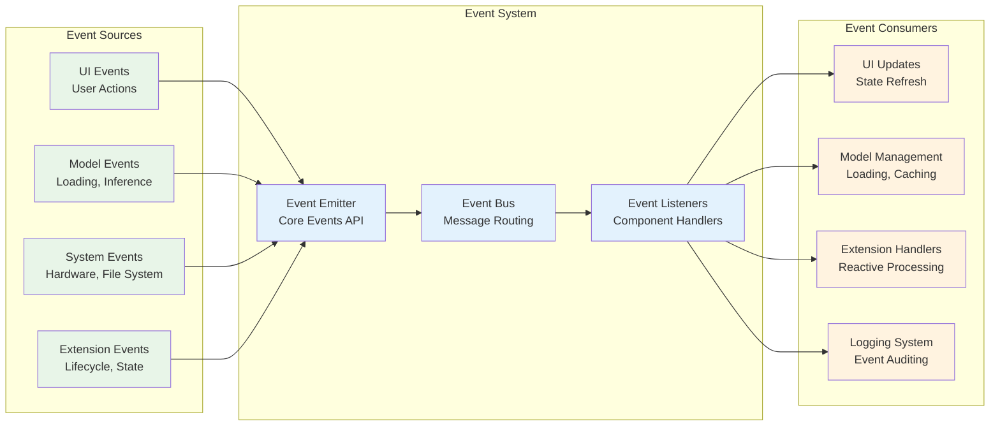
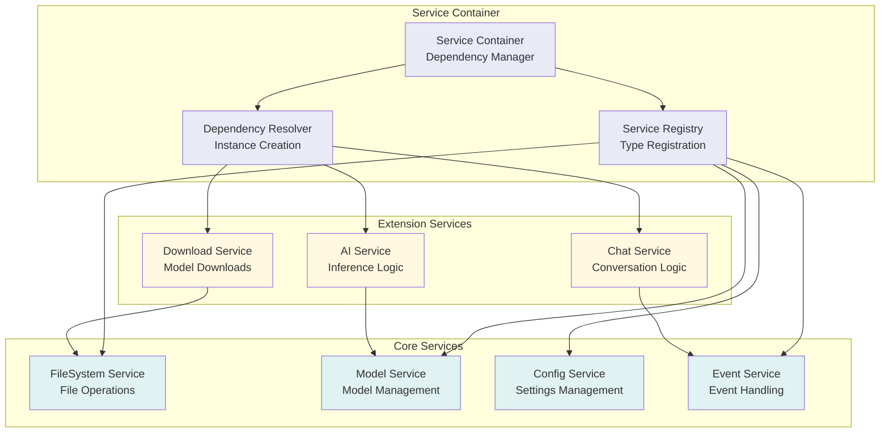
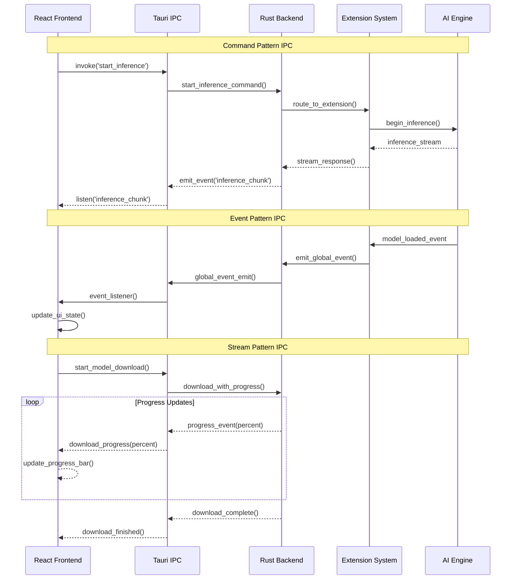
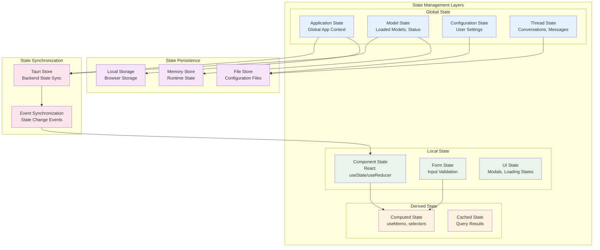
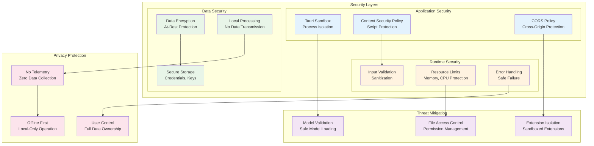

# Developer Architecture Guide

This guide provides detailed technical information for developers working on Jan's architecture.

## Core Architecture Patterns

### Event-Driven Architecture

Jan uses an event-driven architecture to decouple components and enable reactive updates across the system.

### Dependency Injection Pattern

Jan implements dependency injection to manage service dependencies and enable testability.

## Inter-Process Communication

Jan uses multiple IPC mechanisms to enable communication between the frontend and backend components.

## State Management Architecture

Jan implements a hybrid state management approach combining local component state with global application state.

## Security Architecture

Jan implements multiple layers of security to protect user data and ensure safe AI operations.

## Performance Architecture

Jan is designed for optimal performance across different hardware configurations.

```mermaid
graph TB
    subgraph "Performance Optimization"
        subgraph "Model Performance"
            MODEL_CACHE[Model Caching<br/>Memory Management]
            QUANTIZATION[Model Quantization<br/>Size/Speed Tradeoffs]
            BATCH_PROC[Batch Processing<br/>Efficient Inference]
        end

        subgraph "UI Performance"
            VIRTUAL_LIST[Virtual Lists<br/>Large Dataset Rendering]
            LAZY_LOAD[Lazy Loading<br/>On-Demand Components]
            MEMOIZATION[Memoization<br/>Expensive Computation Caching]
        end

        subgraph "System Performance"
            WORKER_THREADS[Worker Threads<br/>Non-Blocking Operations]
            RESOURCE_POOL[Resource Pooling<br/>Connection Management]
            ASYNC_OPS[Async Operations<br/>Non-Blocking I/O]
        end
    end

    subgraph "Performance Monitoring"
        METRICS[Performance Metrics<br/>Real-time Monitoring]
        PROFILING[Performance Profiling<br/>Bottleneck Detection]
        OPTIMIZATION[Auto Optimization<br/>Adaptive Settings]
    end

    MODEL_CACHE --> METRICS
    QUANTIZATION --> PROFILING
    BATCH_PROC --> OPTIMIZATION

    VIRTUAL_LIST --> METRICS
    LAZY_LOAD --> PROFILING
    MEMOIZATION --> OPTIMIZATION

    WORKER_THREADS --> METRICS
    RESOURCE_POOL --> PROFILING
    ASYNC_OPS --> OPTIMIZATION

    classDef modelPerf fill:#e3f2fd
    classDef uiPerf fill:#e8f5e8
    classDef systemPerf fill:#fff3e0
    classDef monitoring fill:#f3e5f5

    class MODEL_CACHE,QUANTIZATION,BATCH_PROC modelPerf
    class VIRTUAL_LIST,LAZY_LOAD,MEMOIZATION uiPerf
    class WORKER_THREADS,RESOURCE_POOL,ASYNC_OPS systemPerf
    class METRICS,PROFILING,OPTIMIZATION monitoring
```

## Development Guidelines

### Architecture Principles

1. **Modularity**: Design components with clear boundaries and minimal coupling
2. **Testability**: Structure code to enable comprehensive unit and integration testing
3. **Performance**: Optimize for local hardware constraints and resource usage
4. **Security**: Implement defense-in-depth security practices
5. **Maintainability**: Write clean, documented code following established patterns

### Component Design Patterns

1. **Composition over Inheritance**: Prefer composition for flexible, reusable components
2. **Dependency Injection**: Use DI for managing service dependencies
3. **Event-Driven Updates**: Leverage events for reactive system updates
4. **Immutable State**: Maintain immutable state for predictable updates
5. **Error Boundaries**: Implement proper error handling and recovery

### Extension Development

1. **Well-Defined APIs**: Use typed interfaces for extension communication
2. **Lifecycle Management**: Proper initialization and cleanup in extensions
3. **Resource Management**: Efficient use of system resources
4. **Error Handling**: Graceful degradation and error recovery
5. **Documentation**: Comprehensive documentation for extension APIs