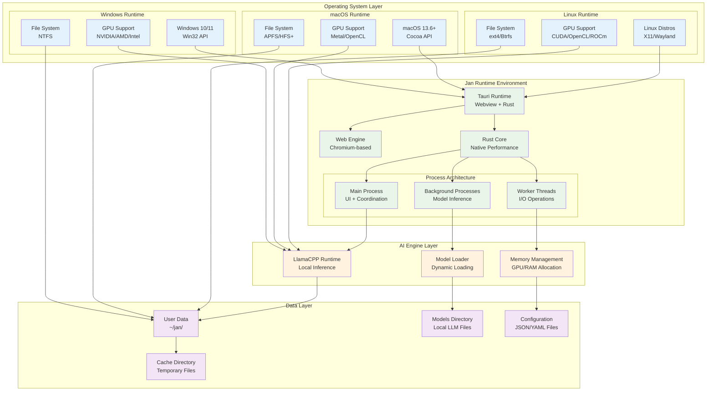
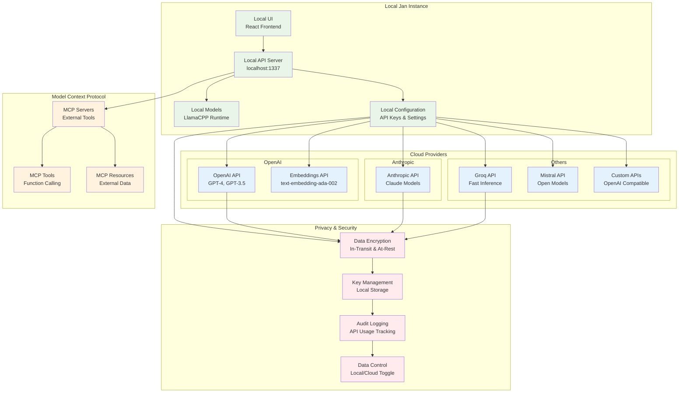

# Infrastructure & Deployment Architecture

This document provides detailed information about Jan's infrastructure patterns, build systems, and deployment strategies.

## Build System Architecture

Jan uses a sophisticated build system that coordinates multiple components and platforms.

```mermaid
graph TB
    subgraph "Source Control"
        REPO[Git Repository<br/>GitHub: menloresearch/jan]
        BRANCHES[Branch Strategy<br/>• main (stable)<br/>• dev (development)<br/>• feature/* (features)]
        TAGS[Release Tags<br/>Semantic Versioning]
    end

    subgraph "Build Pipeline"
        MAKEFILE[Makefile<br/>Build Orchestration]
        YARN_WS[Yarn Workspaces<br/>Dependency Management]
        
        subgraph "Component Builds"
            CORE_BUILD[Core Build<br/>@janhq/core TypeScript]
            EXT_BUILD[Extensions Build<br/>Multiple .tgz Packages]
            WEB_BUILD[Web App Build<br/>Vite + React]
            TAURI_BUILD[Tauri Build<br/>Rust + Web Bundle]
        end
    end

    subgraph "Platform Packaging"
        WIN_PKG[Windows Package<br/>NSIS Installer + .exe]
        MAC_PKG[macOS Package<br/>DMG + App Bundle]
        LINUX_DEB[Linux .deb<br/>Debian Package]
        LINUX_APP[Linux AppImage<br/>Portable Binary]
        FLATPAK[Flatpak Package<br/>Sandbox Distribution]
    end

    subgraph "Distribution"
        GH_RELEASES[GitHub Releases<br/>Official Downloads]
        WEBSITE[jan.ai<br/>Download Portal]
        FLATHUB[Flathub<br/>Linux App Store]
        AUTO_UPDATE[Auto-Update System<br/>In-App Updates]
    end

    REPO --> BRANCHES
    BRANCHES --> TAGS
    TAGS --> MAKEFILE

    MAKEFILE --> YARN_WS
    YARN_WS --> CORE_BUILD
    YARN_WS --> EXT_BUILD
    YARN_WS --> WEB_BUILD
    YARN_WS --> TAURI_BUILD

    CORE_BUILD --> WIN_PKG
    EXT_BUILD --> WIN_PKG
    WEB_BUILD --> WIN_PKG
    TAURI_BUILD --> WIN_PKG

    CORE_BUILD --> MAC_PKG
    EXT_BUILD --> MAC_PKG
    WEB_BUILD --> MAC_PKG
    TAURI_BUILD --> MAC_PKG

    CORE_BUILD --> LINUX_DEB
    EXT_BUILD --> LINUX_DEB
    WEB_BUILD --> LINUX_DEB
    TAURI_BUILD --> LINUX_DEB

    CORE_BUILD --> LINUX_APP
    EXT_BUILD --> LINUX_APP
    WEB_BUILD --> LINUX_APP
    TAURI_BUILD --> LINUX_APP

    LINUX_DEB --> FLATPAK
    LINUX_APP --> FLATPAK

    WIN_PKG --> GH_RELEASES
    MAC_PKG --> GH_RELEASES
    LINUX_DEB --> GH_RELEASES
    LINUX_APP --> GH_RELEASES
    FLATPAK --> FLATHUB

    GH_RELEASES --> WEBSITE
    GH_RELEASES --> AUTO_UPDATE

    classDef source fill:#e3f2fd
    classDef build fill:#e8f5e8
    classDef package fill:#fff3e0
    classDef distribution fill:#f3e5f5

    class REPO,BRANCHES,TAGS source
    class MAKEFILE,YARN_WS,CORE_BUILD,EXT_BUILD,WEB_BUILD,TAURI_BUILD build
    class WIN_PKG,MAC_PKG,LINUX_DEB,LINUX_APP,FLATPAK package
    class GH_RELEASES,WEBSITE,FLATHUB,AUTO_UPDATE distribution
```

## Runtime Architecture

Understanding how Jan operates at runtime across different environments.



## Cloud Integration Architecture

Jan supports hybrid deployments with cloud AI services while maintaining privacy controls.



## Scaling & Performance Architecture

Jan is designed to scale efficiently across different hardware configurations.

```mermaid
graph TB
    subgraph "Hardware Scaling"
        subgraph "Minimum Hardware"
            MIN_CPU[CPU: 4 cores<br/>x86_64 / ARM64]
            MIN_RAM[RAM: 8GB<br/>System Memory]
            MIN_STORAGE[Storage: 50GB<br/>SSD Recommended]
        end
        
        subgraph "Recommended Hardware"
            REC_CPU[CPU: 8+ cores<br/>Modern x86_64]
            REC_RAM[RAM: 16-32GB<br/>Fast DDR4/DDR5]
            REC_GPU[GPU: 8-24GB VRAM<br/>NVIDIA/AMD/Intel]
            REC_STORAGE[Storage: 500GB+<br/>NVMe SSD]
        end
        
        subgraph "High-End Hardware"
            HIGH_CPU[CPU: 16+ cores<br/>Workstation/Server]
            HIGH_RAM[RAM: 64GB+<br/>ECC Memory]
            HIGH_GPU[GPU: 48GB+ VRAM<br/>Professional Cards]
            HIGH_STORAGE[Storage: 2TB+<br/>Fast NVMe RAID]
        end
    end

    subgraph "Performance Optimization"
        MODEL_OPT[Model Optimization<br/>• Quantization (4-bit, 8-bit)<br/>• Context Window Management<br/>• Batch Size Optimization]
        
        MEMORY_OPT[Memory Optimization<br/>• Memory Mapping<br/>• Garbage Collection<br/>• Buffer Pool Management]
        
        COMPUTE_OPT[Compute Optimization<br/>• GPU Acceleration<br/>• Multi-threading<br/>• SIMD Instructions]
        
        IO_OPT[I/O Optimization<br/>• Async File Operations<br/>• Model Caching<br/>• Streaming Responses]
    end

    subgraph "Monitoring & Telemetry"
        PERF_MON[Performance Monitor<br/>Real-time Metrics]
        RESOURCE_MON[Resource Monitor<br/>CPU/Memory/GPU Usage]
        AUTO_TUNE[Auto-tuning<br/>Dynamic Optimization]
    end

    MIN_CPU --> MODEL_OPT
    MIN_RAM --> MEMORY_OPT
    MIN_STORAGE --> IO_OPT

    REC_CPU --> COMPUTE_OPT
    REC_RAM --> MEMORY_OPT
    REC_GPU --> COMPUTE_OPT
    REC_STORAGE --> IO_OPT

    HIGH_CPU --> COMPUTE_OPT
    HIGH_RAM --> MEMORY_OPT
    HIGH_GPU --> COMPUTE_OPT
    HIGH_STORAGE --> IO_OPT

    MODEL_OPT --> PERF_MON
    MEMORY_OPT --> RESOURCE_MON
    COMPUTE_OPT --> AUTO_TUNE
    IO_OPT --> PERF_MON

    classDef minHw fill:#ffebee
    classDef recHw fill:#e8f5e8
    classDef highHw fill:#e3f2fd
    classDef optimization fill:#fff3e0
    classDef monitoring fill:#f3e5f5

    class MIN_CPU,MIN_RAM,MIN_STORAGE minHw
    class REC_CPU,REC_RAM,REC_GPU,REC_STORAGE recHw
    class HIGH_CPU,HIGH_RAM,HIGH_GPU,HIGH_STORAGE highHw
    class MODEL_OPT,MEMORY_OPT,COMPUTE_OPT,IO_OPT optimization
    class PERF_MON,RESOURCE_MON,AUTO_TUNE monitoring
```

## Development & Testing Architecture

The development workflow and testing strategies used by the Jan project.

```mermaid
graph LR
    subgraph "Development Workflow"
        DEV_ENV[Development Environment<br/>• Node.js 20+<br/>• Rust toolchain<br/>• Yarn 4.5+]
        
        CODE_EDIT[Code Editing<br/>• VS Code<br/>• Type checking<br/>• Linting]
        
        LOCAL_BUILD[Local Build<br/>• make dev<br/>• Hot reload<br/>• Debug mode]
    end

    subgraph "Testing Strategy"
        UNIT_TEST[Unit Tests<br/>• Vitest<br/>• Jest<br/>• Cargo test]
        
        INTEGRATION[Integration Tests<br/>• API testing<br/>• Extension testing<br/>• E2E scenarios]
        
        MANUAL_TEST[Manual Testing<br/>• UI testing<br/>• Performance testing<br/>• Hardware compatibility]
    end

    subgraph "Quality Assurance"
        LINTING[Code Linting<br/>• ESLint<br/>• Prettier<br/>• Clippy (Rust)]
        
        TYPE_CHECK[Type Checking<br/>• TypeScript<br/>• Rust compiler<br/>• Schema validation]
        
        SECURITY[Security Scanning<br/>• Dependency audit<br/>• Code analysis<br/>• Vulnerability checks]
    end

    subgraph "CI/CD Pipeline"
        GITHUB_ACTIONS[GitHub Actions<br/>• Automated builds<br/>• Cross-platform testing<br/>• Release automation]
        
        BUILD_MATRIX[Build Matrix<br/>• Windows<br/>• macOS<br/>• Linux]
        
        ARTIFACT_DIST[Artifact Distribution<br/>• GitHub Releases<br/>• Auto-update packages<br/>• Store submissions]
    end

    DEV_ENV --> CODE_EDIT
    CODE_EDIT --> LOCAL_BUILD
    LOCAL_BUILD --> UNIT_TEST

    UNIT_TEST --> INTEGRATION
    INTEGRATION --> MANUAL_TEST
    MANUAL_TEST --> LINTING

    LINTING --> TYPE_CHECK
    TYPE_CHECK --> SECURITY
    SECURITY --> GITHUB_ACTIONS

    GITHUB_ACTIONS --> BUILD_MATRIX
    BUILD_MATRIX --> ARTIFACT_DIST

    classDef development fill:#e3f2fd
    classDef testing fill:#e8f5e8
    classDef quality fill:#fff3e0
    classDef cicd fill:#f3e5f5

    class DEV_ENV,CODE_EDIT,LOCAL_BUILD development
    class UNIT_TEST,INTEGRATION,MANUAL_TEST testing
    class LINTING,TYPE_CHECK,SECURITY quality
    class GITHUB_ACTIONS,BUILD_MATRIX,ARTIFACT_DIST cicd
```

## Infrastructure Best Practices

### 1. **Build System Design**
- **Monorepo Structure**: Yarn workspaces for managing multiple packages
- **Incremental Builds**: Only rebuild changed components
- **Cross-Platform Compatibility**: Unified build process across platforms
- **Dependency Management**: Locked dependencies for reproducible builds

### 2. **Performance Optimization**
- **Asset Optimization**: Minimize bundle size and optimize resources
- **Lazy Loading**: Load components and models on demand
- **Memory Management**: Efficient model loading and unloading
- **GPU Utilization**: Leverage hardware acceleration when available

### 3. **Security & Privacy**
- **Local-First Architecture**: Minimize external dependencies
- **Secure Configuration**: Encrypted storage for sensitive data
- **Sandboxed Execution**: Isolated runtime environment
- **Regular Updates**: Automated security patches

### 4. **Scalability & Maintenance**
- **Modular Architecture**: Independent components for easier maintenance
- **Version Management**: Semantic versioning and compatibility matrices
- **Documentation**: Comprehensive technical documentation
- **Community Support**: Open source development model

This infrastructure architecture ensures that Jan can be built, deployed, and maintained efficiently across all supported platforms while providing optimal performance and security for end users.